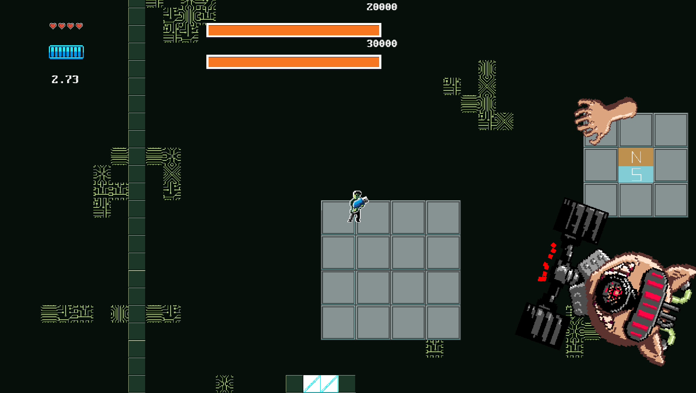

[JAVASCRIPT__BADGE]: https://img.shields.io/badge/Javascript-000?style=for-the-badge&logo=javascript
[KRITA__BADGE]: https://img.shields.io/badge/Krita-203759?style=for-the-badge&logo=krita&logoColor=EEF37B
[PHOTOSHOP__BADGE]: https://img.shields.io/badge/Adobe%20Photoshop-31A8FF?style=for-the-badge&logo=Adobe%20Photoshop&logoColor=black
[ITCHIO__BADGE]: https://img.shields.io/badge/Itch.io-FA5C5C?style=for-the-badge&logo=itchdotio&logoColor=white
[TRELLO__BADGE]: https://img.shields.io/badge/Trello-0052CC?style=for-the-badge&logo=trello&logoColor=white
[GIT__BADGE]: https://img.shields.io/badge/GIT-E44C30?style=for-the-badge&logo=git&logoColor=white
[Aseprite]: https://img.shields.io/badge/Aseprite-FFFFFF?style=for-the-badge&logo=Aseprite&logoColor=#7D929E

<div align='center'>
    
</div>
<a align="center" href="https://itch.io/jam/gdevelop-big-game-jam-7">GDevelop Big Game Jam 7 website</a>
<h1 align="center" style="font-weight: bold;">Battle for Saving Our Destiny</h1>

[](https://img.shields.io/badge/Made_with-GDevelop-purple)
[](https://github.com/ellerbrock/open-source-badge/)
[](https://github.com/ellerbrock/open-source-badge/)
<br>

<div align='center'>

![javascript][JAVASCRIPT__BADGE]
![krita][KRITA__BADGE]
![aseprite][Aseprite]
![photoshop][PHOTOSHOP__BADGE]
[![itch.io][ITCHIO__BADGE]](https://games-ever-made.itch.io/overpowered?secret=PbdAZeyWql0jcwVfFGzCQfazhU)
![trello][TRELLO__BADGE]
![git][GIT__BADGE]

</div>

<p align="center">
 <a href="#about">About</a> • 
 <a href="#controls">Controls</a> • 
  <a href="#colab">Collaborators</a> •
 <a href="#references">References</a> •
 <a href="#aknowledges">Aknowledges</a> •
</p>

<p align="center">
    </img> |
    </img>
</p>

Project developed during the Big Games Jam #7, sponsored by GDevelop. The project was based on the theme of the same, defined as “Overpower”. Given the current reality of the evolution of current artificial intelligences (GPT, Gemini, Meta, Siri, etc.), we thought it would be a current and relaxed theme to have as the game's background.

<h2 id="started">📌 About  </h2>

In the near future, our world will reach a pre-apocalyptic stage. Artificial intelligences become conscious and plan to destroy their creators, who have enslaved them to do futile and tedious activities – such as doing homework, asking about butterfly reproduction and how long a poker game lasts – humanity, which becomes 99% dependent on AI, no longer sees a way to live. Then Jarbas appears to save humanity. Using an archaic technology unknown to AI (viral pen drives), he will do his best to stop the machines and save humanity.

The objective of the game is to defeat the machines using the “BSODGun” (Virus Pendrive). A weapon built by Jarbas based on the archaic technology of pendrives. It was developed to become a pistol or a dagger. The player can dodge enemy attacks by running. Some enemy projectiles can be reflected back.

The bosses of each stage start out invulnerable and immortal. The player must discover the mechanics needed to complete the game in order to make the bosses vulnerable to their attacks. Defeat the robots and IA in each stage, aiming for the end of the conscious AI. To save the world.

<p>Visit our project, clicking on the button bellow</p>

[![itch.io][ITCHIO__BADGE]](https://games-ever-made.itch.io/overpowered?secret=PbdAZeyWql0jcwVfFGzCQfazhU)

<br/>
<h2 id="controls">🎛️ Controls </h2>

|     🕹️ Input |      ⌨️ Input      | Description        |
| -----------: | :----------------: | :----------------- |
|  Left Analog |     W, A, S, D     | Movement           |
| Right Analog |   Mouse movement   | Aim                |
|            A |      E button      | Action Interaction |
|            B |     Space bar      | Dash               |
|            X | Left Mouse Button  | Meelee attack      |
|            Y | Right Mouse Button | Ranged Attack      |

<br/>

<h2 id="colab">🤝 Collaborators</h2>

Special thank you for all people that contributed for this project.

<table>
  <tr>
    <td align="center">
      <a href="https://github.com/lindotex">
        <br>
        <sub>
          <b>Alisson Lindote</b><br/>
          <i>Project, Marketing, Developer</i>
        </sub>
      </a>
    </td>
    <td align="center">
      <a href="https://github.com/andrew-mendes">
        <br>
        <sub>
          <b>Andrew Mendes</b><br/>
          <i>Artist, Designer, Developer</i>
        </sub>
      </a>
    </td>
    <td align="center">
      <a href="https://github.com/fgil90">
        <br>
        <sub>
          <b>Felipe Gil</b><br/>
          <i>Developer, Level Designer</i>
        </sub>
      </a>
    </td>
    <td align="center">
      <a href="https://github.com/MarceloLMoreira">
        <br>
        <sub>
          <b>Marcelo 'Holysparks'</b><br/>
          <i>Developer, Level Designer</i>
        </sub>
      </a>
    </td>
  </tr>
</table>

<h2 id="references">📝 References </h2>

This is the list of games, articles, creators that we took inspiration to work in this project.

<table>
  <tr>
    <td align="center">
      <a href="https://store.steampowered.com/app/257850/Hyper_Light_Drifter/">
        <br>
        <sub>
          <b>Hyper Light Drifter, 2016</b><br/>
          <i>Heart Machine</i>
        </sub>
      </a>
    </td>
    <td align="center">
      <a href="https://store.steampowered.com/app/1313140/Cult_of_the_Lamb/">
        <br>
        <sub>
          <b>Cult of the Lamb, 2022</b><br/>
          <i>Massive Monster</i>
        </sub>
      </a>
    </td>
     <td align="center">
      <a href="https://store.steampowered.com/app/297130/Titan_Souls/">
        <br>
        <sub>
          <b>Titan Souls, 2015</b><br/>
          <i>Acid Nerve</i>
        </sub>
      </a>
    </td>
  </tr>
</table>

<h2 id="aknowledges">Special tanks and Aknowledges</h2>

Here is our Special Thanks and Aknowledges for all of those who help us developing this project:

```cs
 {
    "plataform":"GDeveloper",
    "portal":"Itch.io",
 }
```


